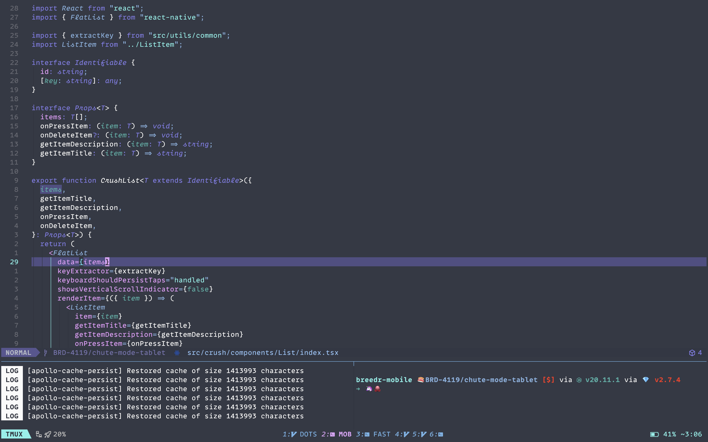
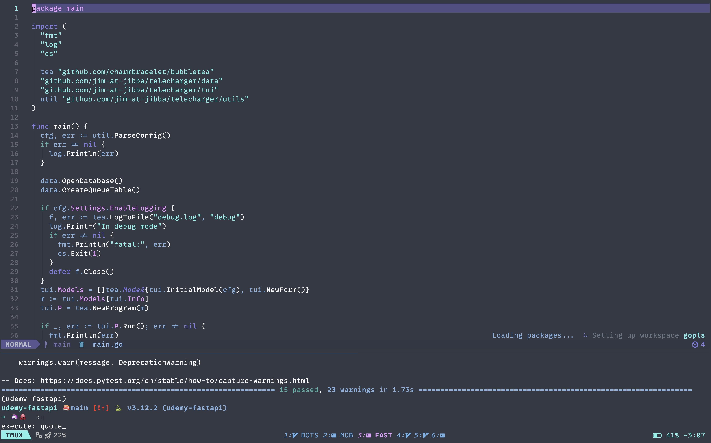
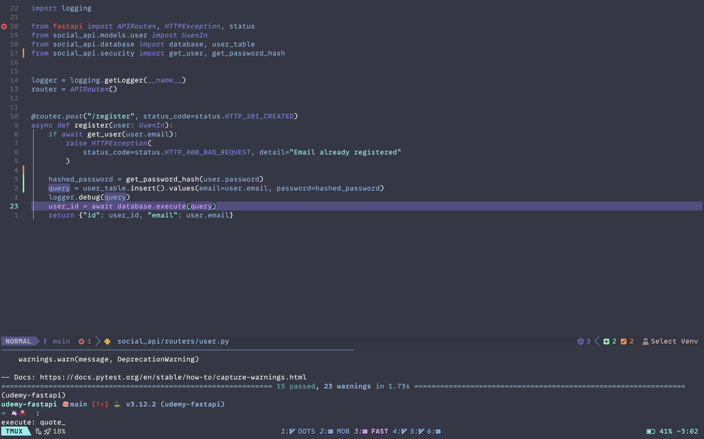
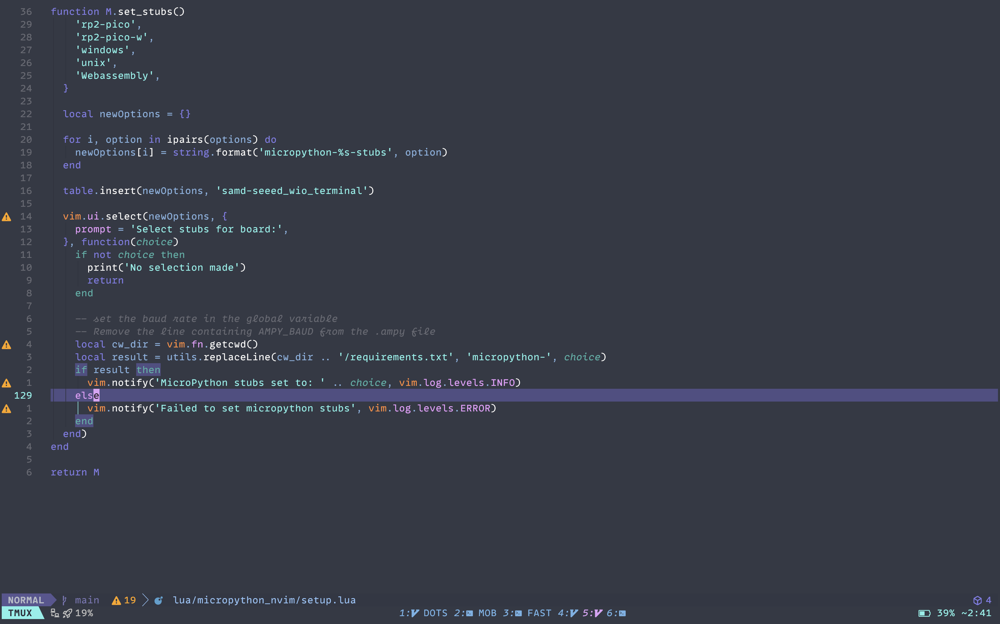

<p>
  <a href="#" target="_blank">
    
  </a>
  <a href="https://twitter.com/jimgbest" target="_blank">
    
  </a>
</p>

> Beautiful, dark colour schema for Neovim

<div align="center">
    <h1>Ariake</h1>
    
</div>

> Created with [colorgen](https://github.com/ChristianChiarulli/colorgen-nvim)


## Install

To install ariake.nvim you need a plugin manager.

- [Lazy.nvim](https://github.com/folke/lazy.nvim)

Example with Lazy.nvim

```lua
return {
    {
        'jim-at-jibba/ariake.nvim',
        config = function ()

         vim.cmd.colorscheme 'ariake'
        end
    }
}
```

## Extra

In the extras folder there are Ariake theme files for:

- [Kitty](https://sw.kovidgoyal.net/kitty/)
- [Spacebar](https://github.com/cmacrae/spacebar)

## Examples






## Maintainers

| [](https://github.com/jim-at-jibba) |
| ----------------------------------------------------------------------------- |
| James Best                                                                  |


* Website: jamesbest.uk
* Twitter: [@jimgbest](https://twitter.com/jimgbest)
* Github: [@jim-at-jibba](https://github.com/jim-at-jibba)
## License

[MIT License](./LICENSE)


## Show your support

Give a ⭐️ if this project helped you!

